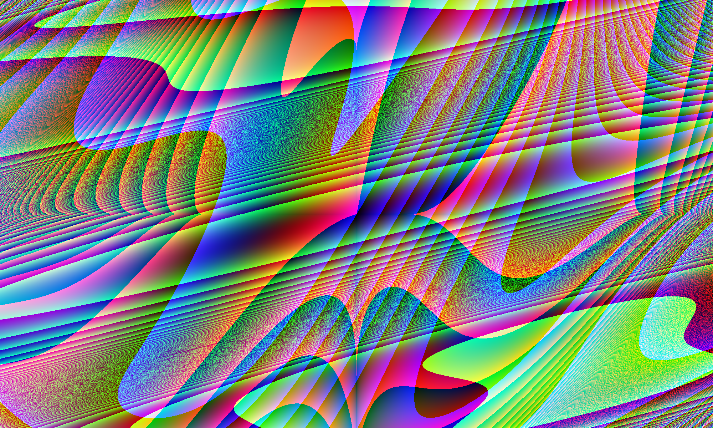

# DumbPic
DumbPic generates a unique image using a variety of randomized mathematical functions. (Nothing special just geometry/algebra)

## Features
- Generates unique images each time by combining random mathematical functions.
- Supports a variety of functions: `sin`, `cos`, `tan`, `exp`, `log`, `sqrt`, `sinh`, `cosh`, `arcsin`, and `arctan`.
- Saves the generated image in a user-specified file format (e.g., PNG, JPEG).
- Reproducibility through a printed random seed.

## Example Output

The program outputs an image like this:



## How to Use

### Requirements

- Python 3.x
- `numpy` and `Pillow` (Python Imaging Library)

You can install the required dependencies using:

```bash
pip install numpy pillow
```

### Running the Program

To run the program, simply call it from the command line and specify the desired output filename:

```bash
python3 newimage.py output.png
```

You can replace `output.png` with any desired filename and image format supported by Pillow (`.jpeg`, `.bmp`, etc.).

### Example

```bash
python3 newimage.py generated_image.png
```

This will generate an image and save it as `generated_image.png`.

### Output

After running, the script will output a unique random image based on trigonometric and other mathematical functions, and it will be saved in the specified file.

## Code Breakdown

1. **Mathematical Functions**: 
    - The program uses a combination of functions like `sin`, `cos`, `tan`, `exp`, and others to create procedural patterns.
2. **Random Function Generator**: 
    - It generates random mathematical expressions using these functions for each of the red, green, and blue (RGB) color channels.
3. **Random Seed**: 
    - A random seed is generated for each run to ensure reproducibility if needed.
4. **Procedural Color Calculation**: 
    - The pixel colors are calculated by scaling the output of these functions into RGB values.
5. **Image Generation**: 
    - The generated color values are applied pixel-by-pixel, and the final image is saved in the format specified by the user.

## Example of Randomized Function

Each RGB channel uses a randomly generated mathematical function, such as:

```python
result = (sin(a * nx + b * ny) + cos(c * nx * ny) + tan(d * nx + e * ny)) ** 2 + (a * nx ** 2 + b * ny ** 3)
```

This ensures every image generated is unique!
